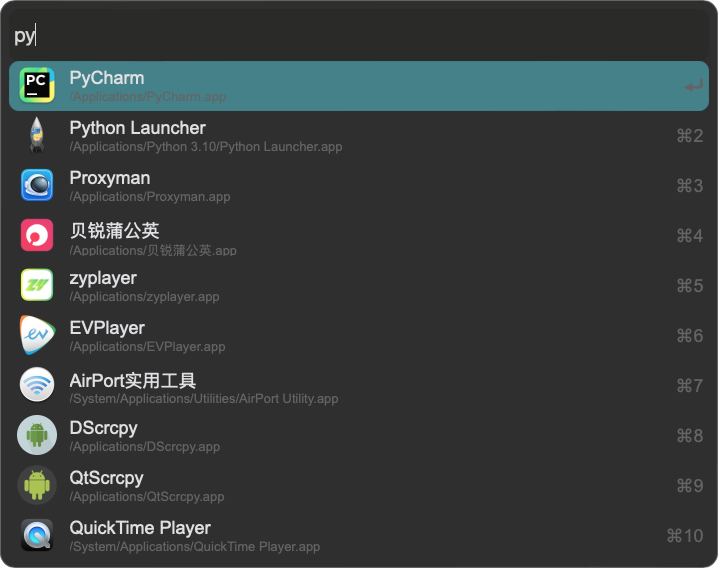
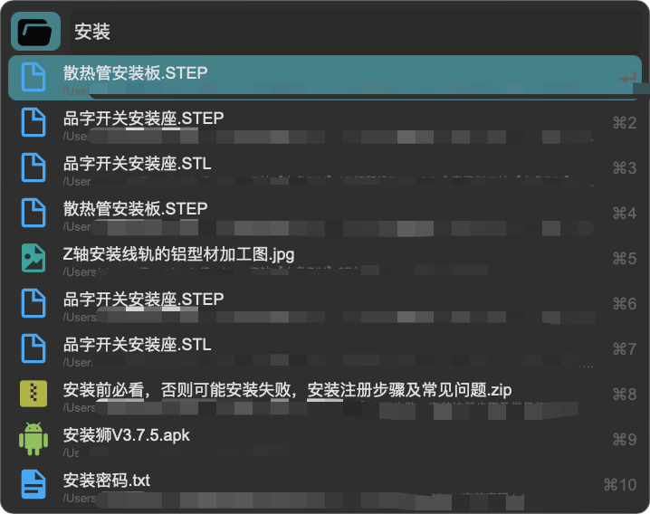
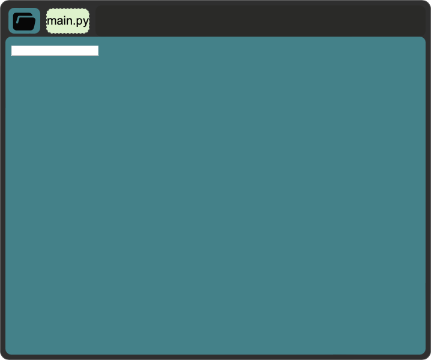
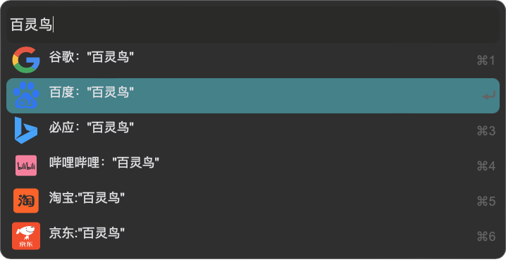

# Lark

> 一个面向 Windows / macOS 的桌面效率启动器：用一个快捷键，把本地应用、文件、网址、计算器、剪贴板历史和插件集中到一个搜索框里。

Lark 基于 **Tauri 2 + Rust + React + Vite** 构建。它的核心体验类似“按下快捷键 → 输入关键词 → 直接执行”，同时保留本地索引、剪贴板历史和可扩展插件能力。

## 功能概览

### 快捷启动与统一搜索

- 使用全局快捷键呼出或隐藏搜索窗口，并自动聚焦输入框。
- 支持键盘导航、Enter 执行、Esc 关闭、Tab 切换搜索模式和数字快捷选择。
- 结果会结合应用使用习惯排序，让常用项目更快出现。
- 没有本地结果时，可直接生成 Google、百度、必应、哔哩哔哩、淘宝、京东等搜索入口。
- 识别 URL 后可直接交给系统默认浏览器打开。
- 支持数学表达式计算，适合处理简单的即时计算。

### 本地应用搜索

- 扫描系统应用并建立本地索引：Windows 支持开始菜单和桌面，macOS 支持 Applications 目录。
- 支持按应用名称、拼音、拼音首字母和部分路径搜索。
- 展示应用图标，选中后直接启动应用。
- Windows 下会尝试激活已经运行的同名窗口，减少重复打开。
- 支持手动重建应用索引。



### 文件搜索

- 扫描配置范围内的目录并建立 SQLite 文件索引。
- 输入框按 `Tab` 可进入文件搜索模式。
- 支持文件名、扩展名、路径、拼音和拼音首字母匹配。
- 选中结果后可直接打开文件，也可以在资源管理器或 Finder 中定位。
- 索引过程会报告进度，并支持手动重建。



### 剪贴板历史

- 后台监听文本、图片和文件剪贴板内容，并自动去重保存。
- 记录内容预览、来源应用、创建时间和图片数据。
- 在剪贴板页面中分页浏览和搜索历史，支持文本和图片预览。
- 选中历史记录后，可将内容写回系统剪贴板并快速粘贴到当前应用。
- 支持按配置数量清理较早记录，避免历史无限增长。

### 插件与组件

- 从应用数据目录的 `plugins/` 加载插件，以 `manifest.json` 作为入口描述文件。
- 插件可以声明关键词、动作、页面、URL 或 Python 入口，并参与主搜索结果。
- 支持内置 React 子页面，以及从插件目录动态加载 JavaScript 和 CSS。
- 已提供 JSON 形式的 Python 插件调用基础和示例插件。
- 损坏插件会单独返回错误，不会阻塞其他插件加载。

插件开发约定见 [`docs/插件开发规范.md`](docs/插件开发规范.md)。仓库中的示例插件位于 [`plugins/`](plugins/) 目录。



### 其他入口

- 支持将关键词发送到外部搜索站点。
- 提供设置页面、快捷键展示和索引重建入口。
- 支持打开应用、文件、URL，以及在文件管理器中定位路径。



## 工作方式

```text
全局快捷键
    ↓
显示搜索窗口并聚焦输入框
    ↓
React 根据输入查询应用、文件、插件和内置工具
    ↓
执行：启动应用 / 打开文件 / 打开 URL / 粘贴剪贴板 / 运行插件
```

本地应用和文件索引、剪贴板历史使用 SQLite 保存；前端会记录应用使用习惯，用于结果排序。

## 技术栈

| 层次 | 技术 |
| --- | --- |
| 桌面壳 | Tauri 2 |
| 原生后端 | Rust |
| 前端 | React 19、Vite |
| UI | Ant Design、styled-components |
| 本地数据 | SQLite、IndexedDB |
| 搜索与工具 | pinyin-pro、mathjs |
| 插件运行 | `manifest.json`、JavaScript、Python runner |

## 开发运行

环境要求：Node.js、pnpm，以及 Rust / Tauri 开发环境。

```bash
# 安装依赖
pnpm install

# 启动前端开发服务器
pnpm dev

# 构建前端产物
pnpm build

# 启动 Tauri 桌面应用
pnpm tauri dev

# 打包桌面应用
pnpm tauri build
```

原生代码检查：

```bash
cd src-tauri
cargo check
cargo test
```

## 项目结构

```text
src/                  React 前端、组件和功能面板
src-tauri/src/        Tauri / Rust 后端与系统集成
src-tauri/win-file-drop/  Windows 文件拖放支持
plugins/              用户插件、manifest 和资源
docs/                 技术说明与开发规范
规划/                 功能计划与实施记录
show/                 README 展示截图
```

## 当前状态

Lark 已经具备“快捷呼出 + 应用搜索 + 文件搜索 + 剪贴板历史 + 插件加载”的基础闭环，适合继续作为个人效率工具和插件运行时原型开发。

以下能力仍在完善中：

- 文件和应用索引的增量更新与更完整的模糊匹配。
- 设置持久化、快捷键编辑后的实时重新注册。
- 插件统一的 `activate / mount / execute / unmount` 生命周期、权限校验和控件 API。
- Python 插件的任务注册、依赖隔离和更完整的长驻运行机制。
- 通知界面与桌面整理功能。

详细的实现现状和已知限制见 [`docs/项目功能与现状摸底.md`](docs/项目功能与现状摸底.md)。

## 相关文档

- [`docs/插件开发规范.md`](docs/插件开发规范.md)：插件目录、manifest 和开发约定
- [`docs/项目功能与现状摸底.md`](docs/项目功能与现状摸底.md)：功能盘点、技术结构和已知问题
- [`docs/文本结果快速粘贴机制.md`](docs/文本结果快速粘贴机制.md)：剪贴板历史快速粘贴实现

## 许可证

项目当前未单独声明开源许可证。如需二次分发或商用，请先确认仓库维护者的授权范围。
