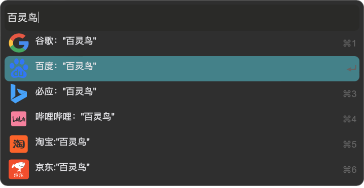

# Tauri + React

开发中

## 计划：
### 展示内容
- [x] app 文件条目
- [x] 更多内容展示 
- [x] 更多内容展示快捷键展示 
- [x] 更多内容展示快捷键绑定
- [ ] 通知显示

### 组件插件
- [x] 内置常用组件
- [x] 插件基本模板
- [x] 插件子页面动态加载
- [ ] 插件控件功能开放
- [ ] 插件控件功能可视化
### 文件检索：
- [x] 文件建立索引 
- [ ] 文件索引状态更新
- [ ] 搜索模糊匹配
- [x] app应用建立索引
- [ ] app应用索引状态更新

### 剪贴板
- [x] 文本监听  
- [x] 图片监听
- [x] 文件监听
- [x] 来源app 
- [x] 快捷键展示
- [ ] 快捷键绑定
- [x] 文本粘贴 
- [ ] 图片粘贴 
- [ ] 文件粘贴

### 桌面整理(计划)
- [ ] 对文件检索到库
- [ ] 对文件进行分类
- [ ] 文件按类别展示
- [ ] 文件按时间展示

目前功能展示：

### 1.本地app快速搜索，用户习惯排序

### 2. 本地文件搜索

### 3. 关键词快速搜索，url访问

### 4. 子页面组件开发，本地文件交互 [todo]

